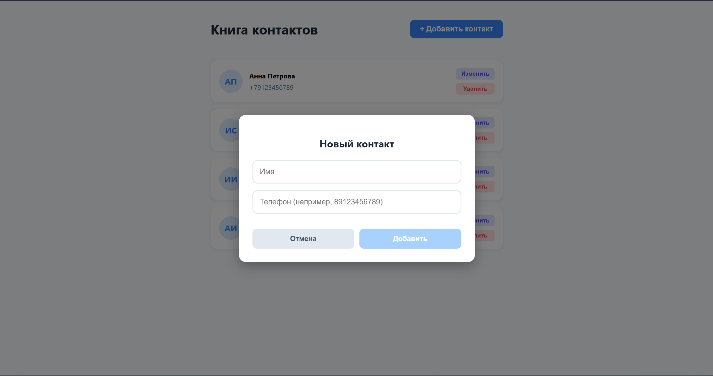
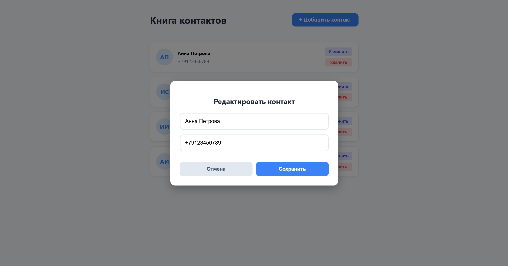

# Книга контактов

## Описание проекта
Книга контактов — это минималистичное веб-приложение на React, созданное для быстрого добавления, просмотра и управления контактами.  
Позволяет удобно хранить имена и телефонные номера, автоматически форматирует номера (даже если введены без «+»), поддерживает редактирование, удаление и копирование номеров одним кликом. Интерфейс крупный, понятный и адаптирован под комфортное использование.

## Примеры работы

### Просмотр контактов

Главная страница отображает список сохранённых контактов с аватарами (инициалами), именем и номером телефона. Клик по номеру копирует его в буфер обмена.

### Добавление нового контакта

Нажатие на кнопку **«+ Добавить контакт»** открывает модальное окно с формой. Приложение принимает номер в любом удобном формате (например, `89123456789`) и автоматически приводит его к международному виду (`+79123456789`).

### Редактирование контакта

Каждый контакт можно изменить с помощью кнопки **«Изменить»**. Открывается та же форма, но с предзаполненными данными. Все изменения сохраняются в списке.

## Как запустить

1. Убедитесь, что у вас установлены [Node.js](https://nodejs.org/) и npm.
2. Склонируйте репозиторий:
   ```bash
   git clone 
   cd contacts_book
   ```
3. Установите зависимости:
      ```
    npm install
      ```
4. Запустите приложение в режиме разработки:
   ```
    npm start
    ```